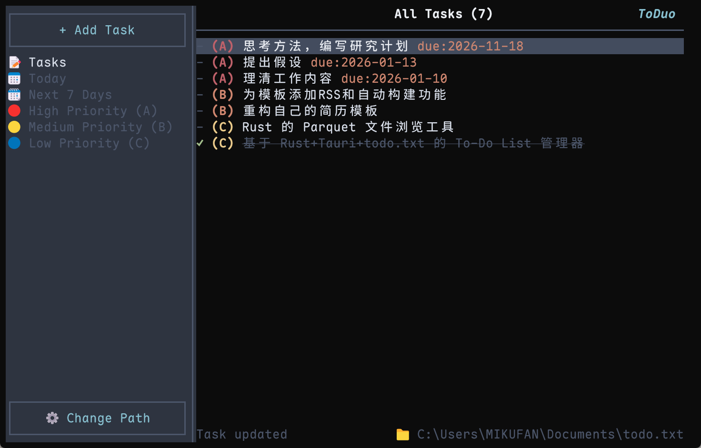

## 📖 简介

**ToDuo** (To-Do + Duo) 是一个高性能、跨平台的 TODO 任务管理工具，使用 Rust 编写。它基于经典的 `todo.txt` 纯文本协议，核心亮点在于 **TUI + GUI 的双模式**。

无论你是习惯鼠标拖拽的**效率办公者**，还是手指不离键盘的**硬核极客**，ToDuo 都能提供最适合你的交互方式：

* **GUI 模式**: 现代、优雅、直观。
* **TUI 模式**: 极速、纯粹、高效。

两者共享同一份数据核心，无缝切换，如影随形。

## ✨ 核心特性 (Features)

* **⚡ 极致性能**: 基于 **Rust** 构建，启动速度快如闪电，内存占用极低。
* **🌗 双模形态**:
  * **ToDuo (GUI)**: 基于 **Tauri 2.0 + Vue 3**。极简的视觉设计，支持系统托盘、快捷键唤醒、深色模式。
  * **td (TUI)**: 基于 **Ratatui**。为终端而生，支持 Vim 风格键位，像写代码一样管理任务。
* **📄 数据自主**: 完全兼容标准 [todo.txt](http://todotxt.org/) 格式。你的数据只是纯文本，本地优先。
* **🔧 极客友好**: 提供强大的 CLI 管道命令支持，轻松集成到你的脚本或工作流中。

## 📸 预览 (Screenshots)

| 图形界面 (GUI) | 终端界面 (TUI) |
| :---: | :---: |
|  |  |
| *现代、清爽、直观* | *硬核、高效、键盘驱动* |

## 🤝 贡献

非常欢迎贡献代码！无论是修复 Bug、增加新功能，还是改进文档。请参考 `CONTRIBUTING.md` 了解详情。

## 📄 许可

本项目基于 [**MIT 许可证**](./LICENSE) 开源。这意味着您可以自由地使用、复制、修改、合并、出版发行、散布、再授权及贩售本软件及其副本。

---

 Made with ❤️ by <a href="https://github.com/Yousa-Mirage">Yousa-Mirage</a> 

