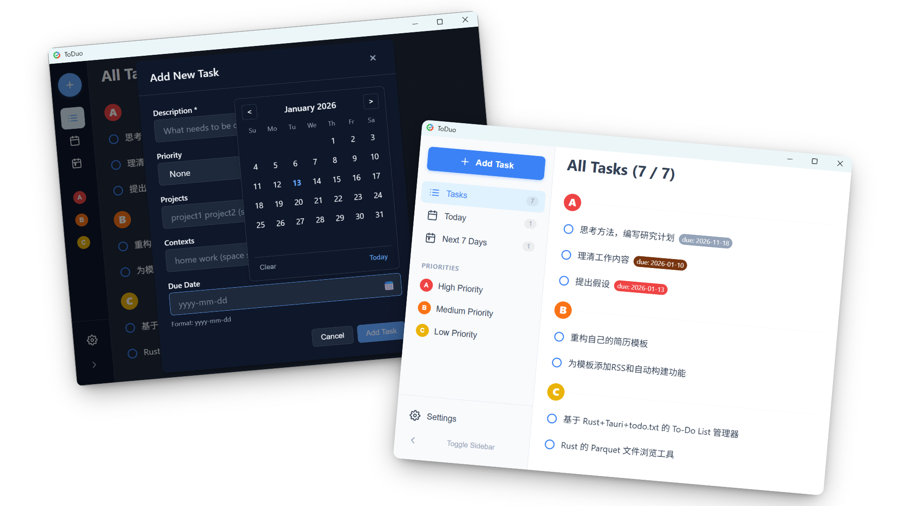

# ToDuo GUI

[English](README.md) | [简体中文](README_zh.md)

**ToDuo** 的图形界面版本，基于 Tauri 2 和 Vue 3 构建。提供了现代化的视觉体验和便捷的桌面集成功能。

## ✨ 特性

### 1. 现代化界面

* **现代设计**: 极简主义，布局清晰，动效流畅
* **深色模式**: 支持跟随系统自动切换深色/浅色主题

### 2. 便捷操作

* **全局快捷键**: 默认 `Ctrl + Alt + Space` 可快速唤醒主窗口，随时随地记录想法。
* **系统托盘**: 支持最小化到托盘，后台静默运行。
* **右键菜单**: 在任务上点击右键可呼出快捷菜单（编辑、删除、复制内容）。

### 3. 任务管理

* **智能过滤**: 侧边栏提供 "今天"、"未来7天"、"项目(Projects)"、"情境(Contexts)" 等自动分类。
* **富文本解析**: 自动高亮显示任务中的 `+project` 和 `@context` 标签。
* **日期选择**: 添加/编辑任务时提供图形化的日期选择器。

## 🛠️ 设置

点击侧边栏底部的 **Settings** 齿轮图标可进入设置：

* **Change Folder**: 切换 todo.txt 文件所在的目录。
* **Theme**: 设置 浅色 / 深色 模式或跟随系统。
* **Tray**: 设置关闭窗口时是否最小化到托盘。

## ⌨️ 快捷键

| 快捷键 | 作用 |
| :--- | :--- |
| `Ctrl + Alt + Space` | 全局：显示/隐藏窗口 |
| `Ctrl + A` | 添加任务 |
